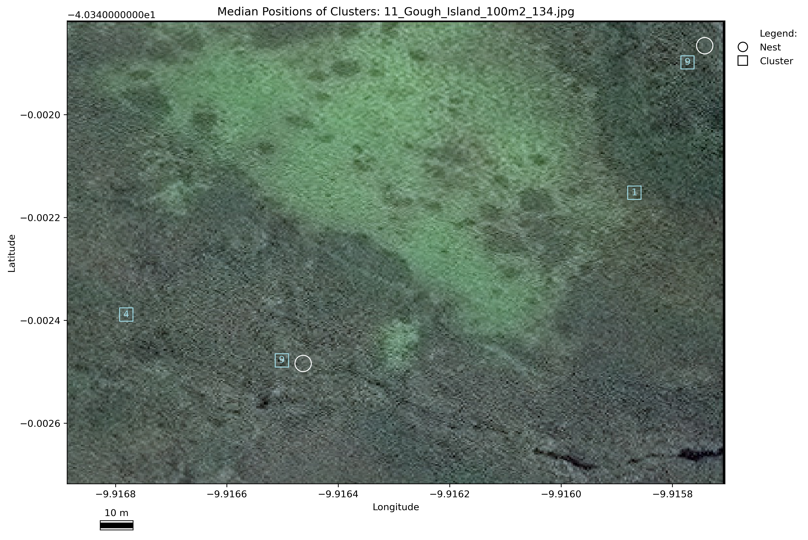

# Tristan Albatross Satellite Image Detection Analysis

[](https://doi.org/10.5281/zenodo.14711473)


This repository contains the data and Python script used in the study:
Attard et al. (2025) Feasibility of using very high-resolution satellite imagery to monitor Tristan albatrosses *Diomedea dabbenena* on Gough Island. *Endangered Species Research*. 56: 187-199. doi: [10.3354/esr01396](https://doi.org/10.3354/esr01396)

The study evaluates the detectability of Tristan albatrosses in high-resolution WorldView-4 satellite imagery (31 cm resolution) over Gough Island, Tristan da Cunha. The goal is to determine whether satellite imagery can facilitate population monitoring of this critically endangered species during the breeding season.

---

### **Table of Contents**

<!-- TOC -->
* [Introduction](#introduction)
* [Script Overview and Workflow](#script-overview-and-workflow)
    * [Workflow summary](#workflow-summary)
    * [Script workflow](#script-workflow)
* [Installation](#installation)
* [Usage](#usage)
* [Structure](#structure)
* [Results](#results)
    * [GLM minimum age](#glm-minimum-age)
    * [GLM model comparison](#glm-model-comparison)
    * [Observer performance](#observer-performance)
    * [Gold standard performance](#gold-standard-performance)
    * [Observer clustered data](#observer-clustered-data)
* [Reusing or Adapting the script](#reusing-or-adapting-the-script)
* [Acknowledgements](#acknowledgements)
* [Licence](#licence)
* [Funding](#funding)

<!-- TOC -->

---

## Introduction

The Tristan albatross *Diomedea dabbenena* is critically endangered, facing threats such as bycatch and predation. Monitoring this species is challenging due to financial constraints and logistical difficulties. Satellite imagery offers a potential solution for cost-effective population monitoring.

This repository includes a Python script that automates the analysis of satellite imagery data to assess the detectability of Tristan albatrosses. It also generates the figures and tables required for the study.

## Script Overview and Workflow

The Python script processes the data and performs the necessary analysis to determine the detectability of Tristan albatrosses in 31 cm resolution satellite imagery. It uses input data from the various folders to run statistical analysis and generate output plots and tables. 

### Workflow summary

1. Satellite image of Gough Island:

- This study uses a single WorldView-4 image (Image ID: 6597a402-ac69-4f62-b346-f99026536906-inv), with a ground sampling distance of 33 cm, resampled to 30 cm resolution, captured at 10:46 am on 1st February 2018. The partially cloud-free satellite image included two primary study sites on Gough Island, where Tristan albatrosses breed: Gonydale and the Hummocks. The image includes multi-spectral and panchromatic files, which were processed using ArcGIS Pro (v3.3.0). 
- The satellite image was orthorectified using a Digital Terrain Model (DTM) from Airbus (product WorldDEMTM) to remove distortion and assign more accurate coordinates. The DTM represented bare earth terrain without obstruction features above ground, and had an absolute vertical accuracy of < 10 m and absolute horizontal accuracy of < 6 m. The Gram-Schmidt pansharpening method was then applied to produce a better visualisation of the multiband image using the high-resolution (30 cm) panchromatic image.   

2. Gold standard dataset:

- Two wildlife remote-sensing specialists (expert 1 and expert 2) conducted manual counts of the orthorectified and un-orthorectified image.
- After completing independent reviews, the experts convened to jointly review their annotations and resolve any uncertainties by examining each annotation together at multiple scales. Features confidently classified as presumed albatrosses by both experts were retained, creating a ‘gold standard’ dataset.
- This dataset was compared with GPS-recorded active nest locations to test whether nest attributes (slope, aspect) or bird plumage (indicating sex and age) influenced detectability in satellite imagery.

3. Observer annotations:

- The orthorectified satellite image was divided into 100 m x 100 m tiles (10,000 m² per tile), producing 303 tiles covering a total area of 3.03 km².
- A random number generator selected 24 tiles containing at least one nest and 6 tiles with no nests based on GPS data.
- These tiles were uploaded to the VGG Image Annotator (VIA), an open-source annotation tool. Nine volunteers (observers 1 to 9) were provided instructions to locate and label albatrosses.
- Observer misclassification rates were assessed against one another, the gold standard, and the nest GPS coordinates.

4. Metrics and analysis:

- Observations were classified as:
	- True Positive (TP): Albatrosses correctly predicted to be present.
	- False Positive (FP): Albatrosses incorrectly predicted to be present.
	- False Negative (FN): Albatrosses incorrectly predicted to be absent.
- Annotations classified as true positives were those located within 3 m of the gold standard or another observer, as Tristan albatross nests are usually > 3 m apart, or within 10 m of the nest GPS coordinates, based on the accuracy of the handheld GPS device.

5. Performance metrics:

- Metrics were calculated to evaluate observer performance:
	- Recall = TPs/(TPs + FNs)
	- Precision = TPs/(TPs + FPs)
	- F1⎼score = 2 x (recall × precision)/(recall + precision) 
- Recall measures how well the observer identifies true positives (i.e., the proportion of actual albatrosses correctly predicted). Precision measures the quality of positive predictions (i.e., the proportion of predicted albatrosses that are truly present). F1-Scores range from 0 to 1, with higher values indicating better overall performance.

### Script workflow:
1. Loads the necessary data (csv, xlsx, or jpeg files from the data folder).
2. Processes the satellite imagery data and field survey nest GPS coordinates.
3. Conducts an analysis to assess albatross detectability based on various predictors.
4. Generates output plots (figures) and tables, which are saved in the output folder.

## Installation
To set up the project:

#### 1. Clone the repository:
```shell
git clone https://github.com/mariergattard/tristan-albatross.git
cd project-name
```

#### 2. Set up a virtual environment (recommended):
```shell
python -m venv venv
```

#### 3. Install dependencies
```shell
pip install -r requirements.txt
```
If requirements.txt is unavailable, manually install dependencies.

## Usage
The script is designed to be run in a Jupyter Notebook environment. Follow these steps:

#### 1. Install JupyterLab:
```shell
pip install jupyterlab
```

#### 2. Launch Jupyter Notebook:
```shell
jupyter notebook
```

#### 3. Run the analysis:

Open Tristan_albatross_satellite_image_detection.ipynb in the python_script folder.
Ensure all input data is correctly placed in the data folder.
Run the cells sequentially to execute the analysis.

## Structure

The project is designed as follows: 

```
Tristan Albatross Satellite Detection Analysis
│
├── Data
│   │  Input files for the python script. 
│   │  Contains satellite image data, nest GPS coordinates, reference and observer annotations. 
│   │
│   ├──Gough_island_landscape_features
│   │       Shapefiles for Gough Island coastline, ocean, contours, and mountain peaks. 
│   │       Source: Extracted from Digital Terrain Model (DTM) with <10 m resolution.
│   │
│   ├──nest_boundaries
│   │       Shapefiles of Tristan albatross nest boundaries on Gough Island provided by RSPB.
│   │
│   ├──nest_GPS_coordinates
│   │       GPS coordinates of Tristan albatross nests in cloud-free regions of the satellite image.
│   │       Source: RSPB for the 2017/18 breeding season. Hand-held GPS accurate to 10 m. 
│   │ 
│   ├──nesting_bird_information:
│   │     ├──Tristan_albatross_age_sex_data.csv: Minimum age and sex of each nesting bird.
│   │     ├──Tristan_albatross_nest_colony_information.csv: 
│   │         Nest ID of active nests in 31 cm orthorectified satellite image from RSPB.
│   │     └──Tristan_albatross_nest_location_data.csv
│   │         Slope (degrees) and aspect data of nests extracted from DTM in ArcGIS Pro.
│   │
│   ├──observer_annotations
│   │        CSV files with raw annotations from 9 observers using VGG Image Annotator (VIA).
│   │
│   ├──reference_annotations
│   │       CSV files & point shapefiles of reference 1 (MRGA) and 2 (PC) annotations.
│   │ 
│   ├──tile_coordinates_georeference
│   │      CSV file with latitude and longitude of the top-left corner of each tile raster.
│   │      Used to convert tile x, y pixel coordinates into geographical coordinates.
│   │ 
│   ├──tile_fishnet_grid
│   │       A 100m x 100m fishnet grid and FID to create tiles in ArcGIS Pro.
│   │ 
│   └──tiles
│          Non-georeferenced satellite image tiles (n=30) in jpeg format. Each measuring 100m x 100m. 
│          30 tiles randomly selected to complete observer annotations.
│          The number at the end of the filename is the FID from tile_fishnet_grid. 
│       
├── Output
│   │  Collection of files exported using the python script. 
│   │  
│   └──tile_images
│       This contains two subfolders: 
│           1. tiles_with_raw_observer_labels_not_georeferenced: 
│            Tile jpeg images with raw non-georeferenced observer annotations. 
│            Symbols: coloured circles represent each unique observer ID. 
│           2. tile_with_observer_nest_labels_georeferenced: 
│            Tile jpeg images containing georeferenced observer labels and nest GPS coordinates.
│            Symbols: square = observers; white circle = nest GPS coordinates.
│
├── python_script
│       Processes annotations and assesses detectability of Tristan albatrosses in satellite imagery. 
│       Input data from 'data' folder and generates all output files. 
│
└── README
	Description of github files, acknowledgements, licencing of script and tiles, funding source. 
```

## Results

The analysis generates key outputs such as:

### GLM minimum age
Generalised linear model (GLM) results for the influence of minimum age on the detectability of nesting albatrosses. Estimates represent the change in log-odds of detection, with corresponding standard errors, z-values, p-values, and odds ratios (OR) provided for each predictor. Confidence intervals are in square brackets. The odds ratio indicates the change in odds of detection per unit increase in minimum age. Males and Females analysed separately.

**Male nesting albatross**
```
                Estimate	 SE	z	p	OR              OR SE	OR z	OR p
----------------------------------------------------------------------------------------------
(Intercept)	0.01             1.10   0.07	0.99	1.01            1.09	0.01	0.99
                [-2.10, 2.12]                           [0.12, 8.31]	
	
Minimum age	0.05             0.06	0.79	0.43	1.05            0.07	0.77	0.44
                [-0.07, 0.17]				[0.93, 1.19]	
----------------------------------------------------------------------------------------------
```

**Female nesting albatross**
```
                Estimate	 SE	z	p	OR              OR SE	OR z	OR p
----------------------------------------------------------------------------------------------
(Intercept)	1.69            1.43	1.18	0.24	5.40            7.73	0.57	0.57
                [-1.12, 4.49]                           [0.33, 89.38]	
	
Minimum age	0.00            0.09	0.01	0.99	1.00            0.09	0.01	0.99
                [-0.18, 0.18]				[0.84, 1.20]	
----------------------------------------------------------------------------------------------
```


### GLM model comparison
Generalised linear models (GLM) testing the effects of incubating parent (sex, minimum age) and nest characteristics (slope and aspect) on detectability of Tristan albatrosses in a 31 cm resolution satellite image (n=52). 

**Top-ranked GLM models (δAICc ≤ 2)**
```
---------------------------------------------------------------------------------------------------------------------------------------------------------
Equation	                        AICc    δAICc	R2	LogLik	 Weight	   95% CI           Coefficient (p-value)
Nest detectability ~ Aspect	        71.06	0.00	0.00	-33.53	 1.00      (-2.71, 1.15)    Aspect: 0.00 (p = 0.87)
Nest detectability ~ Minimum age	70.66	0.00	0.01	-33.33	 1.00      (-1.64, 1.26)    Minimum age: -0.02 (p = 0.52)
Nest detectability ~ Sex	        67.98	0.00	0.05	-31.99	 1.00      (-2.12, -0.29)   Sex: 1.05 (p = 0.08)
Nest detectability ~ Slope	        71.08	0.03	0.00	-33.54	 0.99      (-3.13, 1.83)    Slope: 0.01 (p = 0.99)
Nest detectability ~ Minimum age + Sex	69.82	1.84	0.05	-31.91	 0.40      (-2.63, 0.84)    Minimum age: -0.02 (p = 0.68); Sex: 1.02 (p = 0.10)
Nest detectability ~ Aspect + Sex	69.95	1.97	0.05	-31.97	 0.37      (-3.50, 0.73)    Aspect: 0.00 (p = 0.85); Sex 1.05 (p = 0.08)
Nest detectability ~ Slope + Sex	69.95	1.97	0.05	-31.97	 0.37      (-3.56, 1.60)    Slope: -0.11 (p = 0.86); Sex: 1.06 (p = 0.08)
---------------------------------------------------------------------------------------------------------------------------------------------------------
```

### Observer performance
Summary of detection metrics (F-score, precision and recall values) for presumed albatrosses annotated by nine observers relative to (A) gold standard and (B) active nests.

 
Example of a tile with active nests shown in white circles and observer annotations shown in coloured squares. Satellite imagery © 2024 Maxar Technologies. 


 
Example of a tile with spatially clustered data, with the number of observers in agreement stated inside each square. White circles show active nests recorded with a hand-held GPS during ground survey. Satellite imagery © 2024 Maxar Technologies. 


### Gold standard performance
Summary of detection metrics (F-score, precision and recall values) for presumed albatrosses annotated by references and gold standard in orthorectified and un-orthorectified satellite image relative to active nests. The number of nests matched and reference annotations that did not match a nest are included. 
```
----------------------------------------------------------------------------------------------------------------
Image correction       Annotator	Precision Recall F1 score GPS nests Nest matched No match Total ref 
Orthorectified 	       Expert 1	        0.92	  0.54   0.68	  152	    82	         7	  89
	               Expert 2	        0.89	  0.70   0.79	  152	    107	         13	  120
	               Gold standard    0.89	  0.68   0.77	  152	    103	         13	  116
Un-orthorectified     Expert 1	        0.82	  0.55   0.66	  152	    84	         19	  103
	               Expert 2	        0.82	  0.67   0.74	  152	    102	         22	  124
	               Gold standard    0.81	  0.60   0.69	  152	    91	         22	  113
----------------------------------------------------------------------------------------------------------------
```

### Observer clustered data

Example of a tile with active nests shown in white circles and observer annotations shown in coloured squares. Satellite imagery © 2024 Maxar Technologies. 


Example of a tile with spatially clustered data, with the number of observers in agreement stated inside each square. White circles show active nests recorded with a hand-held GPS during ground survey. Satellite imagery © 2024 Maxar Technologies. 

## Reusing or Adapting the Script

If you reuse or adapt this script, please cite the associated manuscript:

Marie R. G. Attard, Richard A. Phillips, Steffen Oppel, Ellen Bowler and Peter T. Fretwell (2025) Feasibility of using very high-resolution satellite imagery to monitor Tristan albatrosses *Diomedea dabbenena* on Gough Island. *Endangered Species Research*. 56: 187-199. doi: [10.3354/esr01396](https://doi.org/10.3354/esr01396)

## Acknowledgements

This study is a contribution to the Ecosystems and Wildlife from Space programmes within the British Antarctic Survey’s Polar Science for Planet Earth initiative, funded by the Natural Environment Research Programme. MRGA is funded by Darwin Plus (DPLUS132). We are grateful to the Tristan da Cunha Conservation Department and Island Administrators for granting permission to conduct this research.

We acknowledge the Conservation Data Management Unit at RSPB, particularly Alex Whittle and Antje Steinfurth, for providing digital elevation models and geographic information, as well as RSPB for supplying breeding boundary data for Tristan albatrosses at Gough Island. Special thanks go to the Gough Island field team—Roelf Daling, Vonica Perold, Kim Stevens, Jaimie Cleeland, Kate Lawrence, and Fabrice LeBouard—for their dedication in collecting and sharing the ground count data that informed this study.

We sincerely thank Penny Clarke for her invaluable assistance as a reference annotator, and Cath Attard, Connor Bamford, Marcia Blyth, Hannah Cubaynes, Hana Merchant, Elizabeth Pearmain, Norman Ratcliffe, and Sally Thorpe for their efforts in completing observer annotations. Finally, we thank Maxar technologies for granting permission to publish satellite image tiles and associated annotations derived from their imagery.

## Licence
The satellite images and annotations are subject to the [Maxar Satellite Imagery License Agreement](https://www.maxar.com/legal/internal-use-license). The python script and all other data in this repository is governed by the [NERC data policy](https://www.ukri.org/who-we-are/nerc/our-policies-and-standards/nerc-data-policy/) and supplied under [Open Government Licence v3.0](http://www.nationalarchives.gov.uk/doc/open-government-licence/version/3/).

## Funding

Funding was provided by the Darwin Plus (Project ID: DPLUS132). For more details, visit the [Darwin Initiative project website](https://www.darwininitiative.org.uk/project/DPLUS132)


